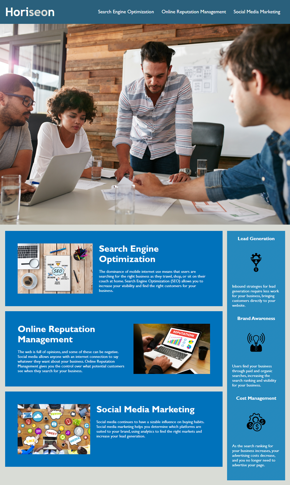

# Horiseon Code Refactor 

## Challenge
Challenge 1 for Columbia's Coding Bootcamp is to refactor existing code to make it cleaner and more accessible. 

## User Story 
AS A marketing agency
I WANT a codebase that follows accessibility standards
SO THAT our own site is optimized for search engines

## Acceptance Criteria
- GIVEN a webpage meets accessibility standards
- WHEN I view the source code
- THEN I find semantic HTML elements
- WHEN I view the structure of the HTML elements
- THEN I find that the elements follow a logical structure independent of styling and positioning
- WHEN I view the image elements
- THEN I find accessible alt attributes
- WHEN I view the heading attributes
- THEN they fall in sequential order
- WHEN I view the title element
- THEN I find a concise, descriptive title

## Description
Module 1 Challenge. This project was to practice and demonstrate and understanding of HTML and CSS. The main goal is to refactor the existing code to be cleaner and more accessible to users. Below is the expected result of the code refactor. 

## Link to Deploy 
[Horiseon Marketing](https://analisegiobbi3.github.io/mod_1_challenge/#social-media-marketing)

## Installation 
N/A

## Usage
This page is for information on Horiseon marketing agency.
This project is to demonstrate skills on refactoring code to make it cleaner and more accessible. 

## Credit
Page is made by Horiseon
Copywrite Horiseon Social Solution Servcies Inc. 

## License
N/A

